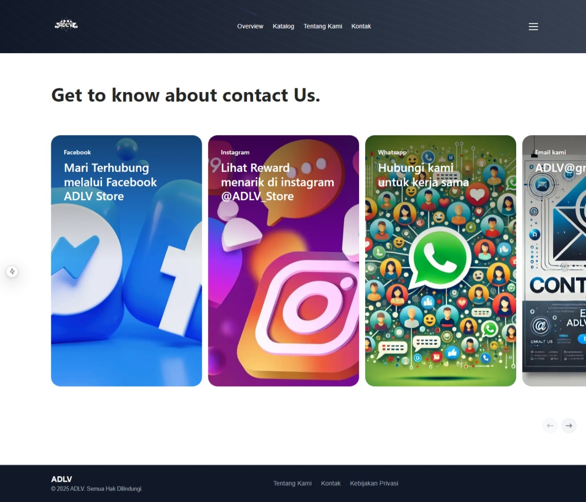
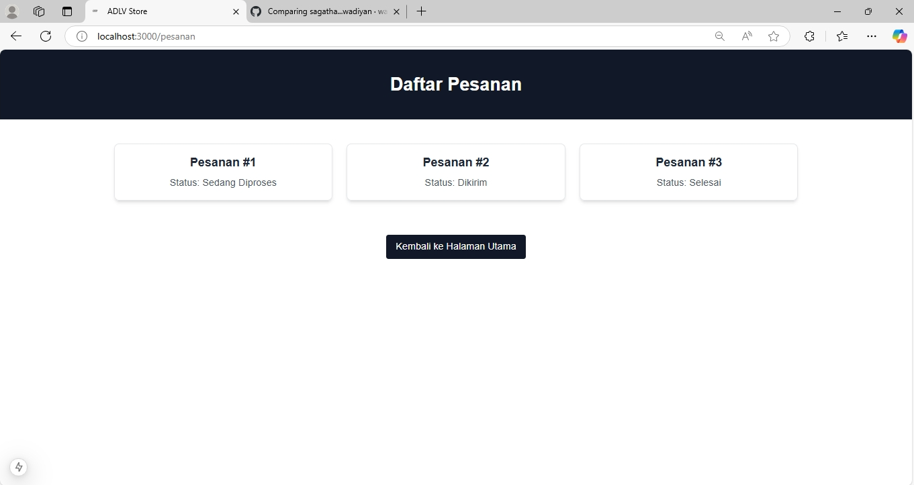

# Dokumentasi Bagian Pengerjaan Proyek

**Nama**: `Rexlicky Verdhika Sagatha`

**Mata Kuliah**: `Pemrograman Web II`

## Daftar Pengerjaan

1. **Membuat Halaman Kontak**
   - **Deskripsi**: Membuat halaman kontak untuk menampilkan informasi kontak.
   - **Screenshot**:
     
   ```tsx
   "use client";
   import Image from "next/image";
   import React from "react";
   import { Carousel, Card } from "@/components/ui/ContactCard";
   ```

export default function Page() {
const cards = data.map((card, index) => (
<Card key={card.src} card={card} index={index} />
));

return (
<div className="w-full h-full py-20">
<h2 className="max-w-7xl pl-4 mx-auto text-xl md:text-5xl font-bold text-neutral-800 dark:text-neutral-200 font-sans">
Get to know about contact Us.
</h2>
<Carousel items={cards} />
</div>
);
}

const DummyContent = () => {
return (
<>
{[...new Array(3).fill(1)].map((\_, index) => {
return (
<div
key={"dummy-content" + index}
className="bg-[#F5F5F7] dark:bg-neutral-800 p-8 md:p-14 rounded-3xl mb-4" >
<p className="text-neutral-600 dark:text-neutral-400 text-base md:text-2xl font-sans max-w-3xl mx-auto">
<span className="font-bold text-neutral-700 dark:text-neutral-200">
The first rule of Apple club is that you boast about Apple club.
</span>{" "}
Keep a journal, quickly jot down a grocery list, and take amazing
class notes. Want to convert those notes to text? No problem.
Langotiya jeetu ka mara hua yaar is ready to capture every
thought.
</p>

</div>
);
})}
</>
);
};

const data = [
{
category: "Facebook",
title: "Mari Terhubung melalui Facebook ADLV Store",
src: "/assets/images/fbbb.png",
content: <DummyContent />,
},
{
category: "Instagram",
title: "Lihat Reward menarik di instagram @ADLV_Store",
src: "/assets/images/ig.png",
content: <DummyContent />,
},
{
category: "Whatsapp",
title: "Hubungi kami untuk kerja sama",
src: "/assets/images/whatsapp.png",
content: <DummyContent />,
},

{
category: "Email kami",
title: "ADLV@gmail.com",
src: "/assets/images/email.png",
content: <DummyContent />,
},
{
category: "Alamat kami",
title: "Jl. Nasution",
src: "/assets/images/adlv_dtore.png",
content: <DummyContent />,
},
{
category: "Hiring",
title: "Hiring for a Staff Web Developer",
src: "/assets/images/hiring.png",
content: <DummyContent />,
},
];

````

2. **Membuat Halaman Login Form**
   - **Deskripsi**: Merancang dan mengimplementasikan form login dengan validasi.
   
   ```tsx
   import React from "react";
import Link from "next/link";

const FormLogin = () => {
  return (
    <>
      <div className="hero min-h-screen fixed inset-0 flex flex-col items-center justify-center z-20">
        <div className="card bg-base-100 w-full max-w-sm shrink-0 shadow-2xl">
          <form className="card-body">
            <div className="form-control">
              <label className="label">
                <span className="label-text">Email</span>
              </label>
              <input
                type="email"
                placeholder="email"
                className="input input-bordered"
                required
              />
            </div>
            <div className="form-control">
              <label className="label">
                <span className="label-text">Password</span>
              </label>
              <input
                type="password"
                placeholder="password"
                className="input input-bordered"
                required
              />
              <label className="label">
                <Link href="#" className="label-text-alt link link-hover">
                  Forgot password?
                </Link>
              </label>
            </div>
            <div className="form-control mt-2">
              <button className="btn bg-gray-900 text-white">Login</button>
            </div>
            <label className="label">
              <Link
                href="/register"
                className="label-text-alt w-full text-center link link-hover"
              >
                Sudah Punya Akun? Daftar
              </Link>
            </label>
          </form>
          <button className="bg-gray-900  w-full  text-white py-2 px-4 rounded-b-xl hover:bg-gray-600">
            <Link href="/">Kembali ke Halaman Utama</Link>
          </button>
        </div>
      </div>
    </>
  );
};

export default FormLogin;
````

3. **Membuat Register Form**

   - **Deskripsi**: Membuat form registrasi pengguna baru dengan validasi data.
     

   ```bash
   import React from "react";
   import Link from "next/link";
   ```

const FormRegister = () => {
return (
<>
<div className="hero min-h-screen fixed inset-0 flex flex-col items-center justify-center z-20">
<div className="card bg-base-100 w-full max-w-sm shrink-0 shadow-2xl">
<form className="card-body">
<div className="form-control">
<label className="label">
<span className="label-text">Email</span>
</label>
<input
                type="email"
                placeholder="email"
                className="input input-bordered"
                required
              />
</div>
<div className="form-control">
<label className="label">
<span className="label-text">Password</span>
</label>
<input
                type="password"
                placeholder="password"
                className="input input-bordered"
                required
              />

              <label className="label">
                <span className="label-text">Confirm Password</span>
              </label>
              <input
                type="password"
                placeholder="Masukan ulang password"
                className="input input-bordered"
                required
              />
            </div>
            <div className="form-control mt-2">
              <button className="btn bg-gray-900 text-white">Daftar</button>
            </div>
            <label className="label">
              <Link
                href="/login"
                className="label-text-alt w-full text-center link link-hover"
              >
                Sudah Punya Akun? Masuk
              </Link>
            </label>
          </form>
          <button className="bg-gray-900  w-full  text-white py-2 px-4 rounded-b-xl hover:bg-gray-600">
            <Link href="/">Kembali ke Halaman Utama</Link>
          </button>
        </div>
      </div>
    </>

);
};

export default FormRegister;

````

4. **Membuat Halaman Pesanan**
- **Deskripsi**: Menampilkan daftar pesanan pengguna dengan status terkini.

``` tsx
import React from "react";
import Link from "next/link";

const OrderList = () => {
const orders = [
  { id: 1, status: "Sedang Diproses" },
  { id: 2, status: "Dikirim" },
  { id: 3, status: "Selesai" },
];

return (
  <div className="text-center">
    <header className="bg-gray-900 text-white flex flex-col justify-center items-center py-10">
      <h1 className="text-3xl font-semibold">Daftar Pesanan</h1>
    </header>
    <div className="grid grid-cols-1 sm:grid-cols-2 lg:grid-cols-3 gap-6 mx-auto my-10 w-3/4">
      {orders.map((order) => (
        <div
          key={order.id}
          className="border rounded-lg p-4 shadow-md hover:shadow-lg transition-shadow"
        >
          <h3 className="text-xl font-semibold mb-2">Pesanan #{order.id}</h3>
          <p className="text-gray-600">Status: {order.status}</p>
        </div>
      ))}
    </div>
    <button
      className="bg-gray-900 text-white py-2 px-4 rounded hover:bg-gray-600 mt-4"
    >
     <Link href="/">
      Kembali ke Halaman Utama
     </Link>
    </button>
  </div>
);
};

export default OrderList;
````

5. **Menambahkan SweetAlert2**

   - **Deskripsi**: Mengintegrasikan SweetAlert2 untuk pemberitahuan dan dialog interaktif.
     

6. **Menambahkan Aset Gedung, Facebook, dan Instagram**

   - **Deskripsi**: Menambahkan aset grafis seperti gambar gedung dan ikon media sosial (Facebook dan Instagram).
      
     
     
     

7. **Fixing Error dan Setup Prisma**
   - **Deskripsi**: Menyelesaikan masalah awal dalam pengaturan Prisma dan melakukan pengujian awal untuk memastikan koneksi database berhasil.
