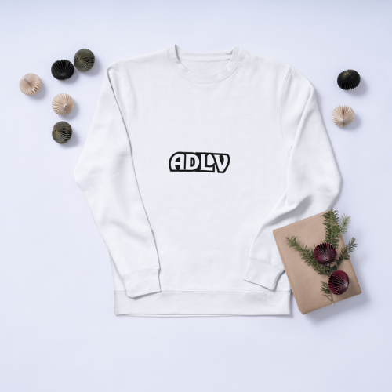
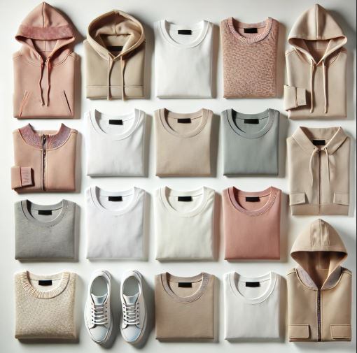
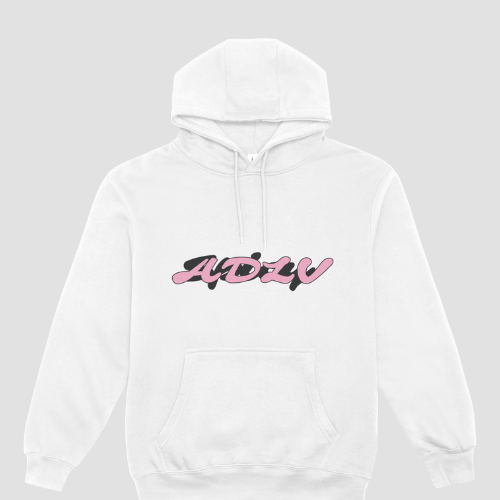
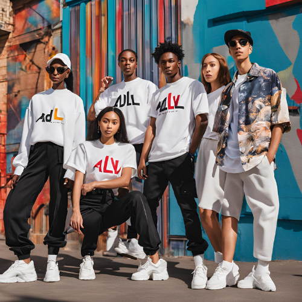
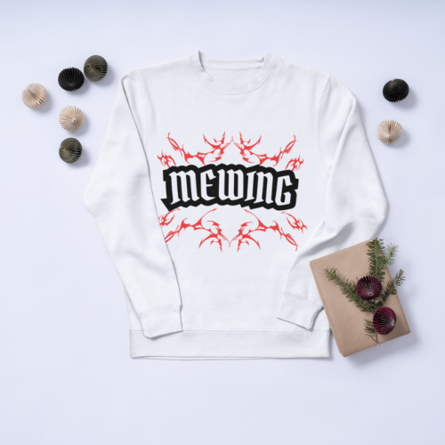
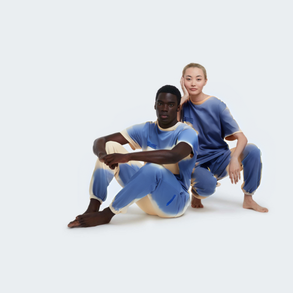
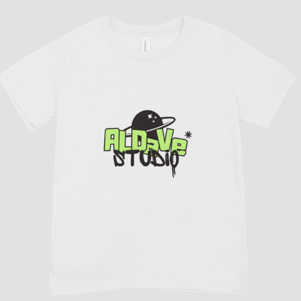

# DOKUMENTASI PROYEK INDIVIDU

## Bagian Yang Dikerjakan


- **Halaman Kontak**  
  

- **Halaman Utama**  
  

- **Toogle Aksi Hamburg Button**  
  

  - **Halaman Katalog**  
  


### Kontribusi
#### Wadiyan (IF22B)
1. **Overview Page**
   Menambahkan halaman untuk menampilkan berbagai fitur seperti:
   - Banner pengantar
   - Produk terbaru
   - Testimoni pengguna
   - Call-to-Action

   Kode utama untuk halaman ini terdapat pada file:
   ```typescript
   // HomePage.js (dalam src/frontend/components)
   import React from "react";
   ...
   export default HomePage;
   ```

2. **Footer Komponen**
   Menambahkan Footer untuk memberikan navigasi tambahan dan informasi hak cipta.
   ```typescript
   "use client";

   const Footer = () => {
     return (
       <footer className="bg-gray-900 text-white py-6">
         <div className="container mx-auto px-4">
           <div className="flex flex-col md:flex-row justify-between items-center space-y-4 md:space-y-0">
             <div>
               <h1 className="text-xl font-bold">ADLV</h1>
               <p className="text-sm text-gray-400">&copy; {new Date().getFullYear()} ADLV. Semua Hak Dilindungi.</p>
             </div>

             <div className="flex space-x-6">
               <a href="/about" className="text-gray-400 hover:text-white transition-colors">Tentang Kami</a>
               <a href="/kontak" className="text-gray-400 hover:text-white transition-colors">Kontak</a>
               <a href="/kebijakan" className="text-gray-400 hover:text-white transition-colors">Kebijakan Privasi</a>
             </div>

             <div className="flex space-x-4">
               <a href="https://facebook.com" target="_blank" rel="noopener noreferrer" className="text-gray-400 hover:text-white transition-colors">
                 <i className="fab fa-facebook-f"></i>
               </a>
               <a href="https://instagram.com" target="_blank" rel="noopener noreferrer" className="text-gray-400 hover:text-white transition-colors">
                 <i className="fab fa-instagram"></i>
               </a>
               <a href="https://twitter.com" target="_blank" rel="noopener noreferrer" className="text-gray-400 hover:text-white transition-colors">
                 <i className="fab fa-twitter"></i>
               </a>
             </div>
           </div>
         </div>
       </footer>
     );
   };

   export default Footer;
   ```

3. **Hamburger Menu**
   Menambahkan komponen menu navigasi dengan gaya hamburger untuk tampilan responsif.
   ```typescript
   import React, { useState } from "react";
   import Link from "next/link";

   const HamburgerMenu = () => {
     const [isOpen, setIsOpen] = useState(false);

     const toggleMenu = () => {
       setIsOpen(!isOpen);
     };

     return (
       <div className="relative z-30">
         <button
           onClick={toggleMenu}
           className="flex flex-col space-y-1.5 p-2 focus:outline-none"
         >
           <div
             className={`w-6 h-0.5 bg-white transition-transform ${
               isOpen ? "rotate-45 translate-y-1.5 h-1" : ""
             }`}
           ></div>
           <div
             className={`w-6 h-0.5 bg-white transition-opacity ${
               isOpen ? "opacity-0" : ""
             }`}
           ></div>
           <div
             className={`w-6 h-0.5 bg-white transition-transform ${
               isOpen ? "-rotate-45 -translate-y-1.5 h-1" : ""
             }`}
           ></div>
         </button>

         {isOpen && (
           <div className="absolute top-10 right-0 bg-white shadow-md rounded-md p-4 w-52">
             <ul className="flex flex-col space-y-2">
               <li>
                 <Link href="/login" className="text-gray-700 hover:font-bold">
                   Login
                 </Link>
               </li>
               <li>
                 <a href="/register" className="text-gray-700 hover:font-bold">
                   Daftar
                 </a>
               </li>
               <li>
                 <a href="/cart" className="text-gray-700 hover:font-bold">
                   Keranjang
                 </a>
               </li>
               <li>
                 <a href="/transaction-history" className="text-gray-700 hover:font-bold">
                   Riwayat Transaksi
                 </a>
               </li>
               <li>
                 <a href="/orders" className="text-gray-700 hover:font-bold">
                   Pesanan
                 </a>
               </li>
               <li>
                 <a href="/logout" className="text-gray-700 hover:text-red-500">
                   Log Out
                 </a>
               </li>
             </ul>
           </div>
         )}
       </div>
     );
   };

   export default HamburgerMenu;
   ```

4. **Loading Wrapper**
   Menambahkan komponen untuk menampilkan animasi loading sementara halaman atau komponen sedang dimuat.
   ```typescript
   "use client";

   import { useState, useEffect } from "react";

   export default function LoadingWrapper({
     children,
   }: {
     children: React.ReactNode;
   }) {
     const [isLoading, setIsLoading] = useState(true);

     useEffect(() => {
       const timer = setTimeout(() => setIsLoading(false), 1000);
       return () => clearTimeout(timer);
     }, []);

     return isLoading ? (
       <div className="flex justify-center items-center h-full">
         <div className="animate-spin rounded-full h-16 w-16 border-t-4 border-black"></div>
       </div>
     ) : (
       <>{children}</>
     );
   }
   ```

5. **Navbar Komponen**
   Menambahkan Navbar untuk navigasi utama dengan dukungan untuk menu responsif.
   ```typescript
   "use client";
   import Link from "next/link";
   import HamburgerMenu from "./HamburgButton";
   import { BackgroundBeams } from "./ui/background-beams";

   const Navbar = () => {
     return (
       <nav className="">
         <div className="container mx-auto px-4 py-3 flex items-center justify-between ">
           <div className="text-2xl font-bold">
             <Link href="/">
               
             </Link>
           </div>
           <div className="hidden md:flex space-x-6">
             <Link
               href="/overview"
               className="text-white hover:font-bold hover:text-white z-10"
             >
               Overview
             </Link>
             <Link
               href="/katalog"
               className="text-white hover:font-bold hover:text-white z-10"
             >
               Katalog
             </Link>
             <Link
               href="/about"
               className="text-white hover:font-bold hover:text-white z-10"
             >
               Tentang Kami
             </Link>
             <Link
               href="/kontak"
               className="text-white hover:font-bold hover:text-white z-10"
             >
               Kontak
             </Link>
           </div>
           <div className="space-x-4">
             <HamburgerMenu />
           </div>
           <BackgroundBeams />
         </div>
       </nav>
     );
   };

   export default Navbar;
   ```

6. **Animated Testimonials**
   Menambahkan komponen untuk menampilkan testimoni dengan animasi dinamis.
   ```typescript
   "use client";

   import { IconArrowLeft, IconArrowRight } from "@tabler/icons-react";
   import { motion, AnimatePresence } from "framer-motion";
   import Image from "next/image";
   import { useEffect, useState } from "react";

   type Testimonial = {
     quote: string;
     name: string;
     designation: string;
     src: string;
   };
   export const AnimatedTestimonials = ({
     testimonials,
     autoplay = false,
   }: {
     testimonials: Testimonial[];
     autoplay?: boolean;
   }) => {
     const [active, setActive] = useState(0);

     const handleNext = () => {
       setActive((prev) => (prev + 1) % testimonials.length);
     };

     const handlePrev = () => {
       setActive((prev) => (prev - 1 + testimonials.length) % testimonials.length);
     };

     const isActive = (index: number) => {
       return index === active;
     };

     useEffect(() => {
       if (autoplay) {
         const interval = setInterval(handleNext, 5000);
         return () => clearInterval(interval);
       }
     }, [autoplay]);

     const randomRotateY = () => {
       return Math.floor(Math.random() * 21) - 10;
     };
     return (
       <div className="max-w-sm md:max-w-4xl mx-auto antialiased font-sans px-4 md:px-8 lg:px-12 py-20 z-20">
         <div className="relative grid grid-cols-1 md:grid-cols-2  gap-20">
           <div>
             <div className="relative h-80 w-full">
               <AnimatePresence>
                 {testimonials.map((testimonial, index) => (
                   <motion.div
                     key={testimonial.src}
                     initial={{
                       opacity: 0,
                       scale: 0.9,
                       z: -100,
                       rotate: randomRotateY(),
                     }}
                     animate={{
                       opacity: isActive(index) ? 1 : 0.7,
                       scale: isActive(index) ? 1 : 0.95,
                       z: isActive(index) ? 0 : -100,
                       rotate: isActive(index) ? 0 : randomRotateY(),
                       zIndex: isActive(index)
                         ? 999
                         : testimonials.length + 2 - index,
                       y: isActive(index) ? [0, -80, 0] : 0,
                     }}
                     exit={{
                       opacity: 0,
                       scale: 0.9,
                       z: 100,
                       rotate: randomRotateY(),
                     }}
                     transition={{
                       duration: 0.4,
                       ease: "easeInOut",
                     }}
                     className="absolute inset-0 origin-bottom"
                   >
                     <Image
                       src={testimonial.src}
                       alt={testimonial.name}
                       width={500}
                       height={500}
                       draggable={false}
                       className="h-full w-full rounded-3xl object-cover object-center"
                     />
                   </motion.div>
                 ))}
               </AnimatePresence>
             </div>
           </div>
           <div className="flex justify-between flex-col py-4">
             <motion.div
               key={active}
               initial={{
                 y: 20,
                 opacity: 0,
               }}
               animate={{
                 y: 0,
                 opacity: 1,
               }}
               exit={{
                 y: -20,
                 opacity: 0,
               }}
               transition={{
                 duration: 0.2,
                 ease: "easeInOut",
               }}
             >
               <h3 className="text-2xl font-bold dark:text-white text-black">
                 {testimonials[active].name}
               </h3>
               <p className="text-sm text-gray-500 dark:text-neutral-500">
                 {testimonials[active].designation}
               </p>
               <motion.p className="text-lg text-gray-500 mt-8 dark:text-neutral-300">
                 {testimonials[active].quote.split(" ").map((word, index) => (
                   <motion.span
                     key={index}
                     initial={{
                       filter: "blur(10px)",
                       opacity: 0,
                       y: 5,
                     }}
                     animate={{
                       filter: "blur(0px)",
                       opacity: 1,
                       y: 0,
                     }}
                     transition={{
                       duration: 0.2,
                       ease: "easeInOut",
                       delay: 0.02 * index,
                     }}
                     className="inline-block"
                   >
                     {word}&nbsp;
                   </motion.span>
                 ))}
               </motion.p>
             </motion.div>
             <div className="flex gap-4 pt-12 md:pt-0">
               <button
                 onClick={handlePrev}
                 className="z-20 text-white my-8 px-10 py-2 rounded-full bg-gray-900 dark:bg-neutral-800 flex items-center justify-center group/button  hover:bg-white hover:border hover:border-gray-900 hover:text-black"
               >
                 Previus
               </button>
               <button
                 onClick={handleNext}
                 className="z-20 text-white my-8 px-10 py-2 rounded-full bg-gray-900 dark:bg-neutral-800 flex items-center justify-center group/button hover:bg-white hover:border hover:border-gray-900 hover:text-black"
               >
                 Next
               </button>
             </div>
           </div>
         </div>
       </div>
     );
   };
   ```

8. **Infinite Moving Cards**
   Menambahkan komponen untuk menampilkan kartu yang bergerak secara horizontal tanpa henti dengan berbagai pengaturan.
   - Properti yang didukung:
     - **items**: Daftar item yang ditampilkan pada kartu (quote, name, title).
     - **direction**: Arah gerakan, bisa "left" atau "right".
     - **speed**: Kecepatan animasi, bisa "slow", "normal", atau "fast".
     - **pauseOnHover**: Menjeda animasi saat kursor berada di atas.
   ```typescript
   "use client";

    import { cn } from "@/utils/utils";
    import React, { useEffect, useState } from "react";

    export const InfiniteMovingCards = ({
    items,
    direction = "left",
    speed = "slow",
    pauseOnHover = true,
    className,
    }: {
    items: {
        quote: string;
        name: string;
        title: string;
    }[];
    direction?: "left" | "right";
    speed?: "fast" | "normal" | "slow";
    pauseOnHover?: boolean;
    className?: string;
    }) => {
    const containerRef = React.useRef<HTMLDivElement>(null);
    const scrollerRef = React.useRef<HTMLUListElement>(null);

    useEffect(() => {
        addAnimation();
    }, []);
    const [start, setStart] = useState(false);
    function addAnimation() {
        if (containerRef.current && scrollerRef.current) {
        const scrollerContent = Array.from(scrollerRef.current.children);

        scrollerContent.forEach((item) => {
            const duplicatedItem = item.cloneNode(true);
            if (scrollerRef.current) {
            scrollerRef.current.appendChild(duplicatedItem);
            }
        });

        getDirection();
        getSpeed();
        setStart(true);
        }
    }
    const getDirection = () => {
        if (containerRef.current) {
        if (direction === "left") {
            containerRef.current.style.setProperty(
            "--animation-direction",
            "forwards"
            );
        } else {
            containerRef.current.style.setProperty(
            "--animation-direction",
            "reverse"
            );
        }
        }
    };
    const getSpeed = () => {
        if (containerRef.current) {
        if (speed === "fast") {
            containerRef.current.style.setProperty("--animation-duration", "20s");
        } else if (speed === "normal") {
            containerRef.current.style.setProperty("--animation-duration", "40s");
        } else {
            containerRef.current.style.setProperty("--animation-duration", "80s");
        }
        }
    };
    return (
        <div
        ref={containerRef}
        className={cn(
            "scroller  z-20  max-w-7xl overflow-hidden bg-white",
            className
        )}
        >
        <ul
            ref={scrollerRef}
            className={cn(
            " flex min-w-full shrink-0 gap-4 py-4 w-max flex-nowrap",
            start && "animate-scroll ",
            pauseOnHover && "hover:[animation-play-state:paused]"
            )}
        >
            {items.map((item, idx) => (
            <li
                className="w-[350px] max-w-full relative rounded-2xl border border-b-0 flex-shrink-0 border-slate-100 px-8 py-6 md:w-[450px]"
                style={{
                background:
                    "linear-gradient(180deg, var(--slate-800), var(--slate-900)",
                }}
                key={item.name}
            >
                <blockquote>
                <div
                    aria-hidden="true"
                    className="user-select-none -z-1 pointer-events-none absolute -left-0.5 -top-0.5 h-[calc(100%_+_4px)] w-[calc(100%_+_4px)]"
                ></div>
                <span className=" relative z-20 text-sm leading-[1.6] text-gray-100 font-normal">
                    {item.quote}
                </span>
                <div className="relative z-20 mt-6 flex flex-row items-center">
                    <span className="flex flex-col gap-1">
                    <span className=" text-sm leading-[1.6] text-gray-400 font-normal">
                        {item.name}
                    </span>
                    <span className=" text-sm leading-[1.6] text-gray-400 font-normal">
                        {item.title}
                    </span>
                    </span>
                </div>
                </blockquote>
            </li>
            ))}
        </ul>
        </div>
    );
    };
    ```
9. **Background Beams Navbar**
   Menambahkan komponen untuk animasi di bg navbar bergerak  tanpa henti dengan berbagai pengaturan.
    ```typescript
    "use client";
    import React from "react";
    import { motion } from "framer-motion";
    import { cn } from "@/utils/utils";

    export const BackgroundBeams = React.memo(
    ({ className }: { className?: string }) => {
        const paths = [
        "M-380 -189C-380 -189 -312 216 152 343C616 470 684 875 684 875",
        "M-373 -197C-373 -197 -305 208 159 335C623 462 691 867 691 867",
        "M-366 -205C-366 -205 -298 200 166 327C630 454 698 859 698 859",
        "M-359 -213C-359 -213 -291 192 173 319C637 446 705 851 705 851",
        "M-352 -221C-352 -221 -284 184 180 311C644 438 712 843 712 843",
        "M-345 -229C-345 -229 -277 176 187 303C651 430 719 835 719 835",
        "M-338 -237C-338 -237 -270 168 194 295C658 422 726 827 726 827",
        "M-331 -245C-331 -245 -263 160 201 287C665 414 733 819 733 819",
        "M-324 -253C-324 -253 -256 152 208 279C672 406 740 811 740 811",
        "M-317 -261C-317 -261 -249 144 215 271C679 398 747 803 747 803",
        "M-310 -269C-310 -269 -242 136 222 263C686 390 754 795 754 795",
        "M-303 -277C-303 -277 -235 128 229 255C693 382 761 787 761 787",
        "M-296 -285C-296 -285 -228 120 236 247C700 374 768 779 768 779",
        "M-289 -293C-289 -293 -221 112 243 239C707 366 775 771 775 771",
        "M-282 -301C-282 -301 -214 104 250 231C714 358 782 763 782 763",
        "M-275 -309C-275 -309 -207 96 257 223C721 350 789 755 789 755",
        "M-268 -317C-268 -317 -200 88 264 215C728 342 796 747 796 747",
        "M-261 -325C-261 -325 -193 80 271 207C735 334 803 739 803 739",
        "M-254 -333C-254 -333 -186 72 278 199C742 326 810 731 810 731",
        "M-247 -341C-247 -341 -179 64 285 191C749 318 817 723 817 723",
        "M-240 -349C-240 -349 -172 56 292 183C756 310 824 715 824 715",
        "M-233 -357C-233 -357 -165 48 299 175C763 302 831 707 831 707",
        "M-226 -365C-226 -365 -158 40 306 167C770 294 838 699 838 699",
        "M-219 -373C-219 -373 -151 32 313 159C777 286 845 691 845 691",
        "M-212 -381C-212 -381 -144 24 320 151C784 278 852 683 852 683",
        "M-205 -389C-205 -389 -137 16 327 143C791 270 859 675 859 675",
        "M-198 -397C-198 -397 -130 8 334 135C798 262 866 667 866 667",
        "M-191 -405C-191 -405 -123 0 341 127C805 254 873 659 873 659",
        "M-184 -413C-184 -413 -116 -8 348 119C812 246 880 651 880 651",
        "M-177 -421C-177 -421 -109 -16 355 111C819 238 887 643 887 643",
        "M-170 -429C-170 -429 -102 -24 362 103C826 230 894 635 894 635",
        "M-163 -437C-163 -437 -95 -32 369 95C833 222 901 627 901 627",
        "M-156 -445C-156 -445 -88 -40 376 87C840 214 908 619 908 619",
        "M-149 -453C-149 -453 -81 -48 383 79C847 206 915 611 915 611",
        "M-142 -461C-142 -461 -74 -56 390 71C854 198 922 603 922 603",
        "M-135 -469C-135 -469 -67 -64 397 63C861 190 929 595 929 595",
        "M-128 -477C-128 -477 -60 -72 404 55C868 182 936 587 936 587",
        "M-121 -485C-121 -485 -53 -80 411 47C875 174 943 579 943 579",
        "M-114 -493C-114 -493 -46 -88 418 39C882 166 950 571 950 571",
        "M-107 -501C-107 -501 -39 -96 425 31C889 158 957 563 957 563",
        "M-100 -509C-100 -509 -32 -104 432 23C896 150 964 555 964 555",
        "M-93 -517C-93 -517 -25 -112 439 15C903 142 971 547 971 547",
        "M-86 -525C-86 -525 -18 -120 446 7C910 134 978 539 978 539",
        "M-79 -533C-79 -533 -11 -128 453 -1C917 126 985 531 985 531",
        "M-72 -541C-72 -541 -4 -136 460 -9C924 118 992 523 992 523",
        "M-65 -549C-65 -549 3 -144 467 -17C931 110 999 515 999 515",
        "M-58 -557C-58 -557 10 -152 474 -25C938 102 1006 507 1006 507",
        "M-51 -565C-51 -565 17 -160 481 -33C945 94 1013 499 1013 499",
        "M-44 -573C-44 -573 24 -168 488 -41C952 86 1020 491 1020 491",
        "M-37 -581C-37 -581 31 -176 495 -49C959 78 1027 483 1027 483",
        ];
        return (
        <div
            className={cn(
            "absolute  h-full w-full inset-0  [mask-size:40px] [mask-repeat:no-repeat] flex items-center justify-center",
            className
            )}
        >
            <svg
            className=" z-0 h-full w-full pointer-events-none absolute "
            width="100%"
            height="100%"
            viewBox="0 0 696 316"
            fill="none"
            xmlns="http://www.w3.org/2000/svg"
            >
            <path
                d="M-380 -189C-380 -189 -312 216 152 343C616 470 684 875 684 875M-373 -197C-373 -197 -305 208 159 335C623 462 691 867 691 867M-366 -205C-366 -205 -298 200 166 327C630 454 698 859 698 859M-359 -213C-359 -213 -291 192 173 319C637 446 705 851 705 851M-352 -221C-352 -221 -284 184 180 311C644 438 712 843 712 843M-345 -229C-345 -229 -277 176 187 303C651 430 719 835 719 835M-338 -237C-338 -237 -270 168 194 295C658 422 726 827 726 827M-331 -245C-331 -245 -263 160 201 287C665 414 733 819 733 819M-324 -253C-324 -253 -256 152 208 279C672 406 740 811 740 811M-317 -261C-317 -261 -249 144 215 271C679 398 747 803 747 803M-310 -269C-310 -269 -242 136 222 263C686 390 754 795 754 795M-303 -277C-303 -277 -235 128 229 255C693 382 761 787 761 787M-296 -285C-296 -285 -228 120 236 247C700 374 768 779 768 779M-289 -293C-289 -293 -221 112 243 239C707 366 775 771 775 771M-282 -301C-282 -301 -214 104 250 231C714 358 782 763 782 763M-275 -309C-275 -309 -207 96 257 223C721 350 789 755 789 755M-268 -317C-268 -317 -200 88 264 215C728 342 796 747 796 747M-261 -325C-261 -325 -193 80 271 207C735 334 803 739 803 739M-254 -333C-254 -333 -186 72 278 199C742 326 810 731 810 731M-247 -341C-247 -341 -179 64 285 191C749 318 817 723 817 723M-240 -349C-240 -349 -172 56 292 183C756 310 824 715 824 715M-233 -357C-233 -357 -165 48 299 175C763 302 831 707 831 707M-226 -365C-226 -365 -158 40 306 167C770 294 838 699 838 699M-219 -373C-219 -373 -151 32 313 159C777 286 845 691 845 691M-212 -381C-212 -381 -144 24 320 151C784 278 852 683 852 683M-205 -389C-205 -389 -137 16 327 143C791 270 859 675 859 675M-198 -397C-198 -397 -130 8 334 135C798 262 866 667 866 667M-191 -405C-191 -405 -123 0 341 127C805 254 873 659 873 659M-184 -413C-184 -413 -116 -8 348 119C812 246 880 651 880 651M-177 -421C-177 -421 -109 -16 355 111C819 238 887 643 887 643M-170 -429C-170 -429 -102 -24 362 103C826 230 894 635 894 635M-163 -437C-163 -437 -95 -32 369 95C833 222 901 627 901 627M-156 -445C-156 -445 -88 -40 376 87C840 214 908 619 908 619M-149 -453C-149 -453 -81 -48 383 79C847 206 915 611 915 611M-142 -461C-142 -461 -74 -56 390 71C854 198 922 603 922 603M-135 -469C-135 -469 -67 -64 397 63C861 190 929 595 929 595M-128 -477C-128 -477 -60 -72 404 55C868 182 936 587 936 587M-121 -485C-121 -485 -53 -80 411 47C875 174 943 579 943 579M-114 -493C-114 -493 -46 -88 418 39C882 166 950 571 950 571M-107 -501C-107 -501 -39 -96 425 31C889 158 957 563 957 563M-100 -509C-100 -509 -32 -104 432 23C896 150 964 555 964 555M-93 -517C-93 -517 -25 -112 439 15C903 142 971 547 971 547M-86 -525C-86 -525 -18 -120 446 7C910 134 978 539 978 539M-79 -533C-79 -533 -11 -128 453 -1C917 126 985 531 985 531M-72 -541C-72 -541 -4 -136 460 -9C924 118 992 523 992 523M-65 -549C-65 -549 3 -144 467 -17C931 110 999 515 999 515M-58 -557C-58 -557 10 -152 474 -25C938 102 1006 507 1006 507M-51 -565C-51 -565 17 -160 481 -33C945 94 1013 499 1013 499M-44 -573C-44 -573 24 -168 488 -41C952 86 1020 491 1020 491M-37 -581C-37 -581 31 -176 495 -49C959 78 1027 483 1027 483M-30 -589C-30 -589 38 -184 502 -57C966 70 1034 475 1034 475M-23 -597C-23 -597 45 -192 509 -65C973 62 1041 467 1041 467M-16 -605C-16 -605 52 -200 516 -73C980 54 1048 459 1048 459M-9 -613C-9 -613 59 -208 523 -81C987 46 1055 451 1055 451M-2 -621C-2 -621 66 -216 530 -89C994 38 1062 443 1062 443M5 -629C5 -629 73 -224 537 -97C1001 30 1069 435 1069 435M12 -637C12 -637 80 -232 544 -105C1008 22 1076 427 1076 427M19 -645C19 -645 87 -240 551 -113C1015 14 1083 419 1083 419"
                stroke="url(#paint0_radial_242_278)"
                strokeOpacity="0.05"
                strokeWidth="0.5"
            ></path>

            {paths.map((path, index) => (
                <motion.path
                key={`path-` + index}
                d={path}
                stroke={`url(#linearGradient-${index})`}
                strokeOpacity="0.4"
                strokeWidth="0.5"
                ></motion.path>
            ))}
            <defs>
                {paths.map((path, index) => (
                <motion.linearGradient
                    id={`linearGradient-${index}`}
                    key={`gradient-${index}`}
                    initial={{
                    x1: "0%",
                    x2: "0%",
                    y1: "0%",
                    y2: "0%",
                    }}
                    animate={{
                    x1: ["0%", "100%"],
                    x2: ["0%", "95%"],
                    y1: ["0%", "100%"],
                    y2: ["0%", `${93 + Math.random() * 8}%`],
                    }}
                    transition={{
                    duration: Math.random() * 10 + 10,
                    ease: "easeInOut",
                    repeat: Infinity,
                    delay: Math.random() * 10,
                    }}
                >
                    <stop stopColor="#18CCFC" stopOpacity="0"></stop>
                    <stop stopColor="#18CCFC"></stop>
                    <stop offset="32.5%" stopColor="#6344F5"></stop>
                    <stop offset="100%" stopColor="#AE48FF" stopOpacity="0"></stop>
                </motion.linearGradient>
                ))}

                <radialGradient
                id="paint0_radial_242_278"
                cx="0"
                cy="0"
                r="1"
                gradientUnits="userSpaceOnUse"
                gradientTransform="translate(352 34) rotate(90) scale(555 1560.62)"
                >
                <stop offset="0.0666667" stopColor="var(--neutral-300)"></stop>
                <stop offset="0.243243" stopColor="var(--neutral-300)"></stop>
                <stop offset="0.43594" stopColor="white" stopOpacity="0"></stop>
                </radialGradient>
            </defs>
            </svg>
        </div>
        );
    }
    );

    BackgroundBeams.displayName = "BackgroundBeams";
    ```

9. **Menambahkan globals.d.ts**

    ```typescript
    declare module "tailwindcss/lib/util/flattenColorPalette" {
    const flattenColorPalette: (
        colors: Record<string, any>
    ) => Record<string, string>;
    export default flattenColorPalette;
    }
    ```
10. **Menambahkan Assets**

- **Logo**  
  

- **Assets Image Keperluan MVP Layout**  
  

- **Assets Banner**  
  

- **Assets Foto Pendiri**  
  

- **Assets Jacket**  
  

- **Assets Model**  
  

- **Assets Baju Lengan Panjang**  
  

- **Assets Model ADLV**  
  

- **Assets Pendiri**  
  

- **Assets T-shirt**  
  

- **Assets Pendiri**  
  